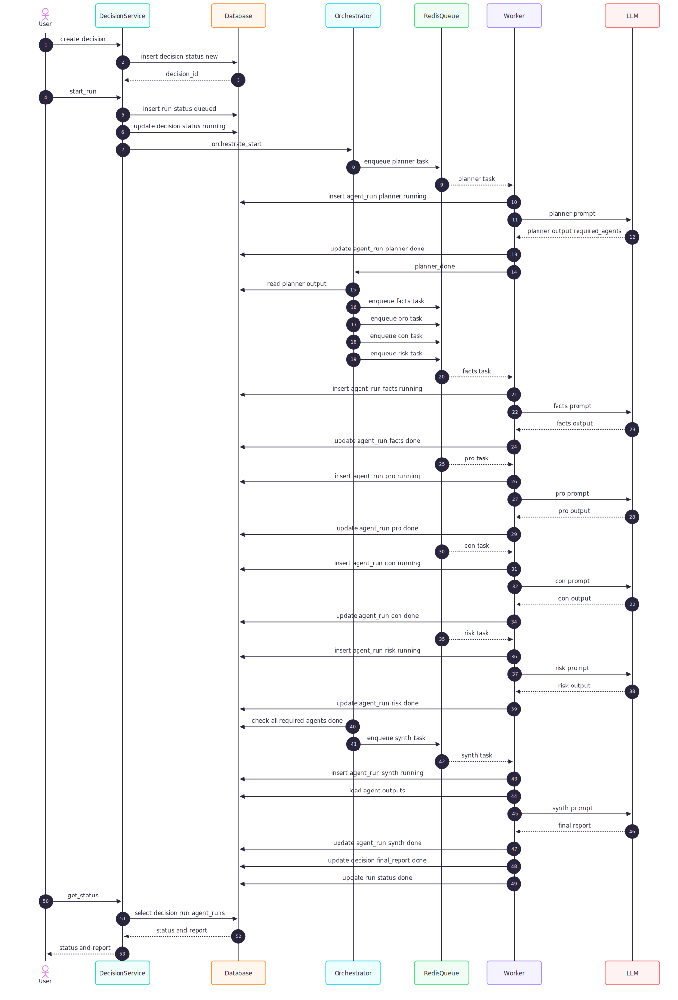

# Decision Copilot (Minimal Python MVP)

A **minimal, backend-first Decision Copilot** implemented as a single Python codebase.

The goal of this project is to explore a **clean, traceable, and extensible multi-agent decision pipeline** without unnecessary infrastructure or frontend complexity.

This repository intentionally avoids:

* Frontend frameworks
* SPA or state-heavy UI
* Containerized application runtime

and focuses instead on:

* Clear orchestration logic
* Persistent state and traceability
* Reproducible agent execution

---

## High-Level Architecture

The system is implemented as a **Python monolith** with optional entry points (CLI or API).
Asynchronous execution is handled via a Redis-backed queue, while **the database is the single source of truth** for all states and outputs.

### Key Components

* **Entry Points**

  * CLI (primary)
  * Optional FastAPI API (for inspection or automation)

* **Decision Service**

  * Creates decisions
  * Starts decision runs
  * Exposes status and final reports

* **Orchestrator**

  * Enforces execution order
  * Schedules agents
  * Detects completion and triggers synthesis

* **Agent Runner**

  * Executes exactly one agent per task
  * Calls the LLM
  * Parses structured output
  * Persists results and metadata

* **Infrastructure**

  * Redis: task queue only
  * Database: decisions, runs, and agent outputs
  * LLM provider: OpenAI or local models

---

## Execution Model (Sequence)

A single decision run follows a strict and observable sequence:

1. Planner agent runs first
2. Planner determines required downstream agents
3. Downstream agents run in parallel
4. Synth agent runs last and produces the final report
5. Decision and run are finalized atomically

The full lifecycle is shown below.

---

## Data Model Overview

The system persists **everything** required for observability and replay.

### decisions

Represents a user decision.

Typical fields:

* id
* question
* context
* status
* final_report
* created_at
* updated_at

### decision_runs

Represents one execution attempt of a decision.

Typical fields:

* id
* decision_id
* mode
* status
* created_at
* updated_at

### agent_runs

Represents a single agent execution.

Typical fields:

* id
* decision_id
* decision_run_id
* agent_name
* status
* model
* latency_ms
* output
* error_message

This structure guarantees:

* Full traceability
* Safe retries and reruns
* No hidden in-memory state

---

## Design Principles

* **Backend-first**
  The decision pipeline is the product. UI is optional.

* **Database as ground truth**
  Redis is not trusted for state.

* **Single responsibility per agent**
  Each agent performs exactly one role.

* **Explicit orchestration**
  No magic chains, no implicit dependencies.

* **Minimal surface area**
  Everything not essential is deferred.

---

## Intended Usage

This project is suitable for:

* Research prototypes
* Decision-support tooling
* Studying multi-agent orchestration patterns
* Backend-heavy LLM systems

It is **not** intended to be:

* A full SaaS product
* A UI showcase
* A real-time system

---

## Roadmap (Deliberately Conservative)

* [ ] CLI-first implementation
* [ ] Redis-backed async workers
* [ ] SQLite for local development
* [ ] PostgreSQL for production
* [ ] Optional FastAPI inspection endpoints
* [ ] Markdown or JSON final reports

---

## Philosophy

This project values:

* Correctness over convenience
* Explicit state over hidden coupling
* Engineering judgment over feature count

If something feels complex, it is probably unnecessary.

---

## License

CC BY-NC-SA 4.0.
